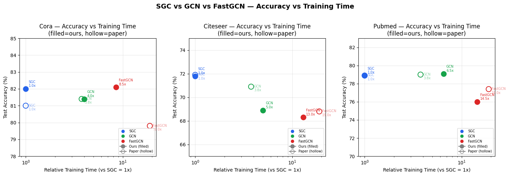
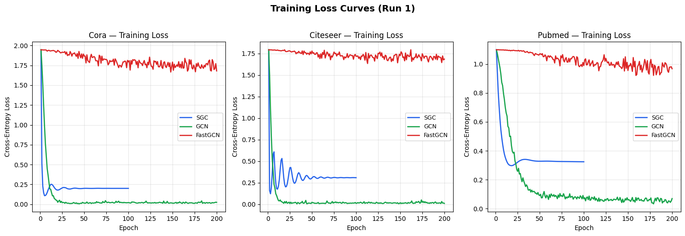

# Simplifying Graph Convolutional Networks — Re-implementation and Extension

This repository is our CS5782 final project for reproducing and extending **Simplifying Graph Convolutional Networks** by Wu et al. (ICML 2019).

The paper introduces **Simple Graph Convolution (SGC)**, a simplified version of Graph Convolutional Networks (GCNs). The main idea is to remove intermediate nonlinearities and collapse multiple trainable weight matrices into one linear classifier. In this way, the model becomes a fixed graph propagation step followed by a simple classifier.

Our project has two parts:

1. **Reproduction**: reproduce SGC on citation networks and Reddit.
2. **Extension**: test SGC on downstream tasks and implement an Adaptive-K SGC variant.

The main question we explore is: **how far can a simple propagation-based model go before we really need more expressive graph neural networks?**

---

## 1. Introduction

GCNs are widely used for graph learning tasks, but the SGC paper argues that some parts of GCN may be unnecessary for many benchmark tasks. Instead of repeatedly applying graph propagation, nonlinear activation, and feature transformation, SGC keeps only the graph propagation step and then trains a linear classifier.

We chose this paper because it is a good example of a simple model challenging a more complex one. It also helped us understand that model performance may come more from graph smoothing and neighborhood aggregation than from deep nonlinear architecture, at least for some homophilous graph datasets.

In our project, we reproduce the core node classification results and then test whether the same idea still works on larger graphs and downstream tasks.

---

## 2. Chosen Result

The main result we reproduce is the node classification experiment from the original paper, especially the citation network results on:

- Cora
- Citeseer
- Pubmed

We compare three models:

- **SGC**: the main simplified model
- **GCN**: the original graph convolution baseline
- **FastGCN**: a sampling-based GCN baseline

The main SGC formulation is:

$$
\bar{X} = S^K X
$$

followed by:

$$
\hat{Y} = \text{softmax}(\bar{X}\Theta)
$$

where:

- $X$ is the node feature matrix
- $S$ is the normalized adjacency matrix with self-loops
- $K$ is the number of propagation steps
- $\Theta$ is the only trainable linear classifier weight

Besides the original node classification reproduction, we also implement three additional modules:

1. **SGC on Reddit**: tests whether SGC scales to a large graph.
2. **SGC on Graph Classification**: evaluates SGC on NCI1 as a downstream graph-level task.
3. **Adaptive-K SGC**: our small innovation that learns a weighted combination of multiple propagation depths.

---

## 3. GitHub Contents

The repository is organized as follows:

```text
.
├── code/
│   ├── citation.py                         # Citation network reproduction: SGC / GCN / FastGCN
│   ├── text_classification.py              # Text classification downstream task on R8
│   ├── sgc.py                              # SGC model implementation
│   ├── gcn.py                              # GCN baseline implementation
│   ├── fastgcn.py                          # FastGCN baseline implementation
│   ├── data_utils.py                       # Dataset loading and preprocessing utilities
│   ├── Reddit_Reproduction_Notebook.ipynb  # SGC / FastGCN / GCN-OOM experiment on Reddit
│   ├── Downstream_Task_Graph_Classification.ipynb  # SGC / GCN / GIN on NCI1
│   ├── Adaptive_K_SGC_on_Reddit.ipynb      # Adaptive-K SGC extension on Reddit
│   └── __init__.py
│
├── data/
│   ├── cora/                               # Raw Planetoid Cora files
│   ├── citeseer/                           # Raw Planetoid Citeseer files
│   ├── pubmed/                             # Raw Planetoid Pubmed files
│   ├── text/                               # R8 text classification files
│   ├── Reddit/                             # Notes for Reddit data
│   └── NCI1_Graph Classification/          # Notes for NCI1 graph classification data
│
├── results/
│   ├── citation/                           # Citation network result CSVs and figures
│   ├── text_classification/                # R8 text classification result files
│   ├── Reddit/                             # Reddit reproduction figures
│   ├── Graph Classification/               # NCI1 graph classification figures
│   └── Adaptive-K SGC on Reddit/           # Adaptive-K SGC result figures
│
└── README.md
```

The main script for citation network reproduction is `code/citation.py`. The Reddit, graph classification, and Adaptive-K experiments are provided as notebooks because they are easier to run and inspect in Google Colab.

---

## 4. Methodology and Re-implementation Details

### 4.1 Citation Network Reproduction

For Cora, Citeseer, and Pubmed, we implement SGC, GCN, and FastGCN.

#### SGC

Our SGC implementation follows the paper directly:

1. Add self-loops to the graph.
2. Build the normalized adjacency matrix.
3. Compute $S^KX$ as K-step feature propagation.
4. Train a linear classifier on the propagated features.

Since $S^KX$ does not depend on trainable parameters, it can be precomputed and cached. This is the main reason why SGC is much faster than standard GCN.

#### GCN

The GCN baseline is a standard two-layer GCN. It applies graph convolution, ReLU activation, dropout, and a final classifier. We include it because SGC is directly derived by simplifying GCN.

#### FastGCN

FastGCN is included as an efficiency-oriented baseline. It uses sampling to reduce the cost of graph convolution. This lets us compare SGC with both the original GCN and a faster GCN-style model.

---

### 4.2 Text Classification on R8

We also test SGC on a downstream text classification task using the R8 dataset.

Following the graph-based text classification setup, we build a corpus-level graph with:

- document nodes
- word nodes
- document-word edges based on TF-IDF
- word-word edges based on PMI

Then we apply SGC with $K=2$ and train a classifier for document labels. We also include GCN as a comparison baseline under the same graph construction setting.

In our implementation, we use `TruncatedSVD` to reduce the feature dimension to avoid memory issues. This makes the experiment easier to run locally, but it can also partly explain why our accuracy is lower than the original paper's reported result.

---

### 4.3 SGC on Reddit

Reddit is much larger than Cora, Citeseer, and Pubmed, so it is useful for checking whether SGC is scalable.

In the Reddit notebook, we compare:

- **SGC** with K-step propagation and L-BFGS training
- **FastGCN** with importance sampling
- **GCN** as an OOM baseline

For SGC, we use a train-node subgraph, standardize features, precompute sparse $S^KX$, and then train a linear classifier. This follows the main idea of the original Reddit experiment in the SGC paper.

The full-batch GCN baseline runs out of memory in our setting, so our main Reddit comparison is between SGC and FastGCN.

---

### 4.4 Graph Classification on NCI1

To test whether SGC generalizes beyond node classification, we also evaluate it on graph classification using the NCI1 dataset.

This task is different because each data point is a whole graph rather than a single node. We compare:

- **SGC graph classifier**
- **GCN graph classifier**
- **GIN graph classifier**

For graph classification, node embeddings are converted into graph embeddings using global pooling. This experiment is important because it shows a limitation of SGC: for tasks that require stronger structural representation learning, simple smoothing may not be enough.

---

### 4.5 Adaptive-K SGC

A limitation of standard SGC is that it uses a fixed propagation depth $K$. However, different datasets or nodes may need different neighborhood ranges.

To address this, we implement **Adaptive-K SGC**. Instead of using only one propagation depth, the model computes several feature matrices:

$$
X, SX, S^2X, \ldots, S^{K_{max}}X
$$

Then it learns softmax weights over these feature matrices:

$$
X_{adaptive} = \alpha_0X + \alpha_1SX + \alpha_2S^2X + \cdots + \alpha_KS^KX
$$

The final classifier is still linear. Therefore, Adaptive-K SGC keeps the simple spirit of SGC but makes the propagation depth more flexible.

In our experiment, we set `K_max = 4` on Reddit.

---

## 5. Reproduction Steps

### 5.1 Clone the Repository

```bash
git clone <your-repo-url>
cd <your-repo-name>
```

### 5.2 Install Dependencies

This project uses Python, PyTorch, PyTorch Geometric, NumPy, SciPy, Matplotlib, Pandas, Scikit-learn, and Tabulate.

A typical setup is:

```bash
pip install torch
pip install torch-geometric
pip install numpy scipy pandas matplotlib scikit-learn tabulate
```

For Reddit and NCI1, we recommend running the notebooks on Google Colab with GPU enabled.

---

### 5.3 Citation Network Experiments

Make sure the citation data are organized as:

```text
data/
├── cora/
├── citeseer/
└── pubmed/
```

Each folder should contain the raw Planetoid files, such as `ind.cora.x`, `ind.cora.y`, `ind.cora.graph`, and `ind.cora.test.index`.

Train SGC on Cora:

```bash
python code/citation.py train --model SGC --dataset Cora
```

Train GCN on Pubmed:

```bash
python code/citation.py train --model GCN --dataset Pubmed \
    --lr 0.01 --weight_decay 5e-4 --epochs 200 \
    --save_path checkpoints/gcn_pubmed.pt
```

Evaluate a saved checkpoint:

```bash
python code/citation.py eval --model GCN --dataset Pubmed \
    --checkpoint checkpoints/gcn_pubmed.pt
```

Run the full citation reproduction experiment:

```bash
python code/citation.py run_all
```

Quick smoke test:

```bash
python code/citation.py run_all --datasets Cora --n_runs 3
```

Expected outputs:

```text
results/citation/
├── summary.csv
├── paper_reference.csv
├── comparison_figure.png
└── comparison_figure_loss.png
```

---

### 5.4 Text Classification Experiment

Run the R8 text classification experiment:

```bash
python code/text_classification.py --dataset R8 --K 2 --svd_dim 800
```

The script expects the data files to be named:

```text
data/text/r8.clean
data/text/r8
```

If the files are stored as `r8.clean.txt` and `r8.txt`, either rename them or update the file paths in `load_corpus()` inside `text_classification.py`.

Expected outputs:

```text
results/text_classification/
├── text_cls_R8_K2.json
└── text_cls_R8_K2.txt
```

---

### 5.5 Reddit Reproduction Experiment

Open and run:

```text
code/Reddit_Reproduction_Notebook.ipynb
```

The notebook downloads Reddit automatically through PyTorch Geometric:

```python
from torch_geometric.datasets import Reddit

dataset = Reddit(root="/tmp/Reddit")
data = dataset[0]
```

Expected outputs:

```text
results/Reddit/
├── Results Table on Reddit.png
└── Training and Performance Comparison on Reddit.png
```

---

### 5.6 Graph Classification Downstream Task

Open and run:

```text
code/Downstream_Task_Graph_Classification.ipynb
```

The notebook downloads NCI1 automatically through PyTorch Geometric:

```python
from torch_geometric.datasets import TUDataset

dataset = TUDataset(root="/content/NCI1", name="NCI1")
```

Expected outputs:

```text
results/Graph Classification/
├── Results Table on NCI1.png
├── Accuracy vs Training Time on NCI1.png
├── Training Loss on NCI1.png
├── Validation Accuracy on NCI1.png
└── Test Accuracy on NCI1.png
```

---

### 5.7 Adaptive-K SGC Experiment

Open and run:

```text
code/Adaptive_K_SGC_on_Reddit.ipynb
```

The key part is to precompute multi-hop features:

```text
X, SX, S^2X, S^3X, S^4X
```

Then the model learns weights over these propagation depths and trains a linear classifier.

Expected outputs:

```text
results/Adaptive-K SGC on Reddit/
├── Adaptive-K SGC Results Table.png
├── Adaptive-K  SGC Accuracy.png
├── Adaptive-K SGC Micro-F1.png
├── Traning loss of Adaptive-K .png
├── Learned Adaptive-K weights.png
└── Evolution of Adaptive-K weights.png
```

---

## 6. Results and Insights

### 6.1 Citation Network Results

| Dataset | Model | Test Accuracy (%) | Avg Time / Run |
|---|---|---:|---:|
| Cora | SGC | 82.0 ± 0.0 | 0.2s |
| Cora | GCN | 81.4 ± 0.9 | 0.8s |
| Cora | FastGCN | 82.1 ± 1.2 | 1.4s |
| Citeseer | SGC | 71.8 ± 0.0 | 0.2s |
| Citeseer | GCN | 68.9 ± 1.2 | 0.9s |
| Citeseer | FastGCN | 68.3 ± 1.0 | 2.3s |
| Pubmed | SGC | 78.9 ± 0.0 | 0.2s |
| Pubmed | GCN | 79.1 ± 0.5 | 1.2s |
| Pubmed | FastGCN | 76.0 ± 0.8 | 2.8s |

Paper reference values:

| Dataset | Model | Paper Test Accuracy (%) |
|---|---|---:|
| Cora | SGC | 81.0 |
| Cora | GCN | 81.4 |
| Cora | FastGCN | 79.8 |
| Citeseer | SGC | 71.9 |
| Citeseer | GCN | 70.9 |
| Citeseer | FastGCN | 68.8 |
| Pubmed | SGC | 78.9 |
| Pubmed | GCN | 79.0 |
| Pubmed | FastGCN | 77.4 |

Our citation network results are close to the original paper. SGC is competitive with GCN and FastGCN, while training much faster.

```markdown



```

---

### 6.2 Text Classification Results on R8

| Dataset | Model | Our Test Accuracy | Paper Accuracy | Time |
|---|---|---:|---:|---:|
| R8 | SGC | 92.42% | 97.2% | 18.471s |
| R8 | GCN | 77.34% | 97.0% | 64.0s |

SGC is about **3.5x faster** than GCN in our run. Although our reproduced SGC accuracy is lower than the paper result, it still clearly outperforms our GCN baseline. A likely reason is that our implementation uses TruncatedSVD to reduce memory usage.

---

### 6.3 Reddit Results

| Dataset | Model | Test Micro-F1 | Val Micro-F1 | Total Time | Note |
|---|---|---:|---:|---:|---|
| Reddit | SGC | 94.63% | 94.48% | 5.73s | K=2, standardized, L-BFGS |
| Reddit | FastGCN | 90.35% | 90.57% | 1581.86s | importance sampling |
| Reddit | GCN | OOM | OOM | OOM | full-batch GCN not scalable |

This result supports the main efficiency claim of SGC. On Reddit, SGC is both faster and more accurate than our FastGCN run, while full-batch GCN is not feasible due to GPU memory limitations.

```markdown


```

---

### 6.4 Graph Classification Results on NCI1

| Dataset | Model | Best Val Accuracy | Best Test Accuracy | Training Time |
|---|---|---:|---:|---:|
| NCI1 | SGC | 64.72% | 65.45% | 111.07s |
| NCI1 | GCN | 77.86% | 79.81% | 141.02s |
| NCI1 | GIN | 80.54% | 81.75% | 129.18s |

This downstream task shows the limitation of SGC. SGC is still computationally simple, but it performs worse than GCN and GIN. This suggests that for graph classification, nonlinear feature extraction and stronger structural representation may be important.

```markdown


```

---

### 6.5 Adaptive-K SGC Results on Reddit

| Dataset | Model | K_max | Best Test Accuracy | Best Test Micro-F1 | Total Time |
|---|---|---:|---:|---:|---:|
| Reddit | Adaptive-K SGC | 4 | 94.07% | 94.07% | 66.51s |

The learned Adaptive-K weights were:

| Propagation Depth | Weight |
|---|---:|
| K = 0 | 0.1043 |
| K = 1 | 0.3706 |
| K = 2 | 0.2762 |
| K = 3 | 0.1426 |
| K = 4 | 0.1064 |

The model assigns the largest weights to shallow propagation depths, especially `K = 1` and `K = 2`. This suggests that local neighborhood information is most useful on Reddit, while deeper propagation may contribute less and may risk oversmoothing.

Adaptive-K does not outperform fixed-K SGC in our current run, but it gives a more flexible and interpretable extension of SGC.

```markdown


```

---

## 7. Conclusion

Overall, our results are consistent with the main message of the SGC paper. For homophilous node classification tasks, graph propagation plus a linear classifier can be surprisingly strong and much faster than more complex GNN models.

At the same time, SGC is not always enough. In the NCI1 graph classification experiment, SGC performs worse than GCN and GIN, which suggests that nonlinear transformations and expressive graph-level representations are still useful for more complex graph tasks.

Our Adaptive-K experiment also shows a possible direction for improving SGC. Instead of fixing one propagation depth, the model can learn how much to use each neighborhood range. Even though it did not beat fixed-K SGC here, it makes the model more flexible while remaining simple.

The main lesson we learned is that model complexity should be justified by the task. SGC is a very strong baseline, but more expressive GNNs are still important when the task needs richer structural information.

---

## 8. References

Wu, F., Souza, A., Zhang, T., Fifty, C., Yu, T., & Weinberger, K. Q. (2019). **Simplifying Graph Convolutional Networks**. Proceedings of the 36th International Conference on Machine Learning (ICML).

Kipf, T. N., & Welling, M. (2017). **Semi-Supervised Classification with Graph Convolutional Networks**. International Conference on Learning Representations (ICLR).

Defferrard, M., Bresson, X., & Vandergheynst, P. (2016). **Convolutional Neural Networks on Graphs with Fast Localized Spectral Filtering**. Advances in Neural Information Processing Systems (NeurIPS).

Hamilton, W. L., Ying, Z., & Leskovec, J. (2017). **Inductive Representation Learning on Large Graphs**. Advances in Neural Information Processing Systems (NeurIPS).

Chen, J., Ma, T., & Xiao, C. (2018). **FastGCN: Fast Learning with Graph Convolutional Networks via Importance Sampling**. International Conference on Learning Representations (ICLR).

Perozzi, B., Al-Rfou, R., & Skiena, S. (2014). **DeepWalk: Online Learning of Social Representations**. Proceedings of the 20th ACM SIGKDD Conference on Knowledge Discovery and Data Mining.

Grover, A., & Leskovec, J. (2016). **node2vec: Scalable Feature Learning for Networks**. Proceedings of the 22nd ACM SIGKDD Conference on Knowledge Discovery and Data Mining.

von Luxburg, U. (2007). **A Tutorial on Spectral Clustering**. Statistics and Computing.

Xu, K., Hu, W., Leskovec, J., & Jegelka, S. (2019). **How Powerful are Graph Neural Networks?** International Conference on Learning Representations (ICLR).

Yao, L., Mao, C., & Luo, Y. (2019). **Graph Convolutional Networks for Text Classification**. AAAI Conference on Artificial Intelligence.

---

## 9. Acknowledgements

This project was completed as part of our CS5782 final project. We would like to thank the course staff for providing the opportunity to reproduce and extend a real machine learning paper.

We also referred to the original SGC paper and related graph learning papers when designing our baselines and experiments. This project helped us better understand both the strength and the limitation of simple graph propagation models.
